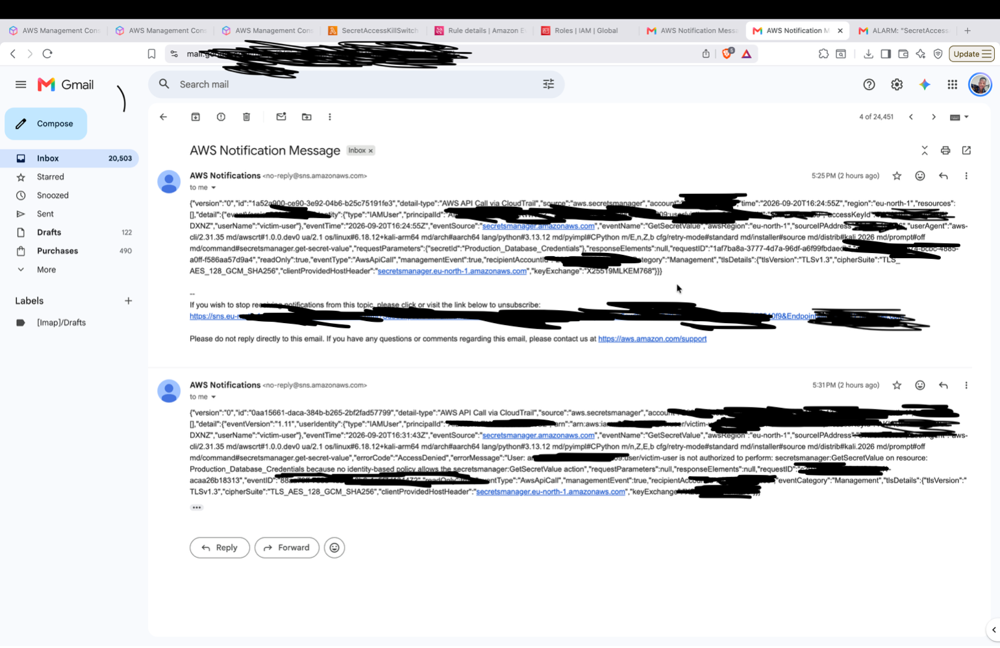
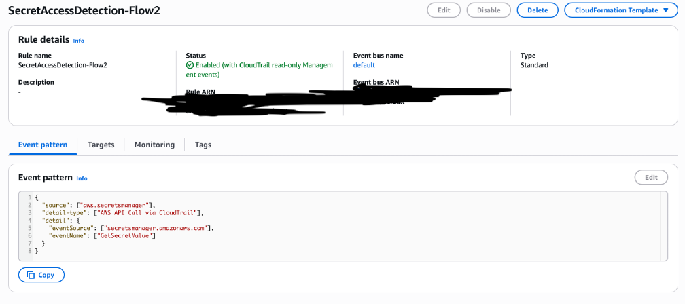
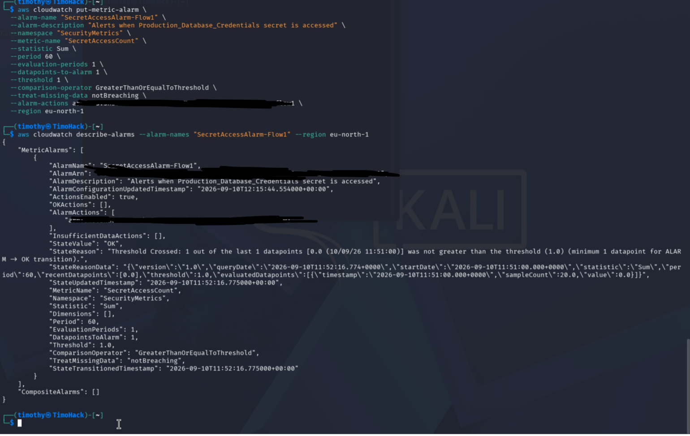
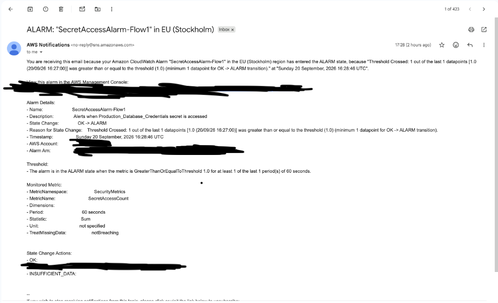
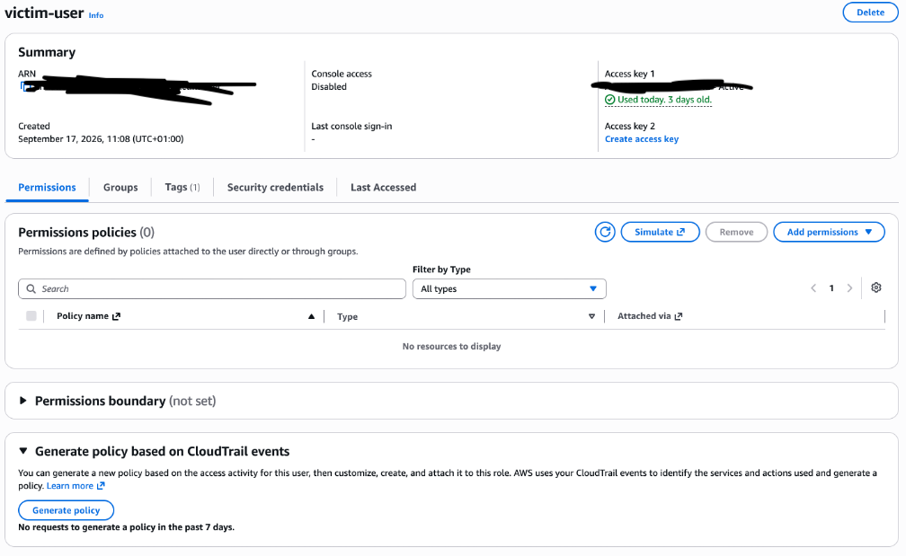
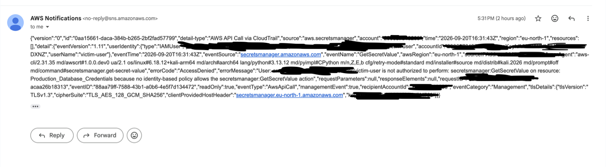

# AWS Security Monitoring & Active-Defence Kill-Switch

A cloud security project that detects access to a sensitive AWS secret in near real-time and **automatically revokes the attacker's permissions** the moment they touch it, turning a passive monitoring setup into an active defence system.

Built entirely with native AWS services (CloudTrail, CloudWatch, EventBridge, SNS, Lambda, Secrets Manager, IAM, S3) in the `eu-north-1` region.

> **Note on this repository:** This project was built and tested in a personal AWS lab account. All account IDs, IP addresses, and access keys shown in screenshots have been redacted. The secret used is a decoy (honeytoken) containing dummy values.

---

## The idea in one line

Store a secret that **no legitimate system ever reads**, then treat *any* access to it as an attack, alert instantly, and automatically lock the attacker out.

This is the **honeytoken** pattern. It sidesteps the hardest problem in security monitoring, telling normal access from malicious access, by creating an asset where all access is, by definition, suspicious. A single read is all the signal you need.

---

## Architecture

```
                    Attacker reads honeytoken
                    (secretsmanager:GetSecretValue)
                              │
                              ▼
                        AWS CloudTrail
                     (records the API call)
                              │
          ┌───────────────────┴───────────────────┐
          ▼                                         ▼
   FLOW 1 (log-based)                        FLOW 2 (event-driven)
   CloudWatch Logs                           EventBridge Rule
        │                                          │
   Metric Filter                          ┌────────┴────────┐
        │                                 ▼                 ▼
   CloudWatch Alarm (≥1)              SNS Topic          Lambda
        │                             (email)         (KILL-SWITCH)
        ▼                                                  │
   SNS Topic (email)                          Detaches victim's IAM
                                              policy → attacker locked out
```

Two detection pipelines run in parallel so they can be **compared**:

| | **Flow 1 — CloudWatch** | **Flow 2 — EventBridge** |
|---|---|---|
| Mechanism | Poll: logs → metric filter → alarm | Push: event bus → rule |
| Speed (observed) | ~3 minutes slower | **~1 minute** |
| Alert content | Threshold summary only | Full event: user, source IP, time |
| Triggers kill-switch? | No | **Yes** |

---

## How it works

1. **The honeytoken.** A secret named `Production_Database_Credentials` is stored in AWS Secrets Manager. Nothing legitimate ever reads it.
2. **Recording.** A multi-region CloudTrail trail captures every management API call, including `GetSecretValue`, and streams events into CloudWatch Logs.
3. **Detection - Flow 1.** A CloudWatch **metric filter** scans the log group for `GetSecretValue` on the honeytoken and increments a custom metric. A **CloudWatch alarm** (threshold ≥ 1, 1-minute period) fires on a single access and publishes to an SNS topic → email.
4. **Detection - Flow 2.** An **EventBridge rule** matches the same event directly on the event bus and publishes to a second SNS topic → email. Because `GetSecretValue` is a *read-only* event, the rule is created with the `ENABLED_WITH_ALL_CLOUDTRAIL_MANAGEMENT_EVENTS` state, without this, the rule silently never fires.
5. **Active defence - the kill-switch.** The EventBridge rule has a **second target**: an AWS Lambda function. On trigger, Lambda reads the attacker's identity from the event and calls `iam:DetachUserPolicy` to strip all their permissions. The attacker's very next command is denied.

---

## The kill-switch, with two independent safety layers

The Lambda function will only ever act on the designated victim user, enforced two ways:

- **In code:** an allow-list (`ALLOWED_TARGET`) - the function refuses to act on any user except `victim-user`.
- **In IAM:** the Lambda's execution role can only call `DetachUserPolicy` on `victim-user` (resource-scoped policy).

This is defence-in-depth applied to the security tooling itself: a kill-switch that cannot be turned against its own operator. See [`lambda/kill_switch.py`](lambda/kill_switch.py) and [`policies/killswitch-iam-policy.json`](policies/killswitch-iam-policy.json).

---

## Proof it works

The test: become the attacker, read the secret, then try again.

```
# First attempt — SUCCEEDS (attacker has SecretsManagerReadWrite)
$ aws secretsmanager get-secret-value --secret-id Production_Database_Credentials --profile victim
{ "SecretString": "{\"username\":\"password\"}" ... }

# ~1 second later, the kill-switch has fired.

# Second attempt (identical command) — DENIED
$ aws secretsmanager get-secret-value --secret-id Production_Database_Credentials --profile victim
An error occurred (AccessDeniedException): User victim-user is not authorized to
perform: secretsmanager:GetSecretValue ... because no identity-based policy allows it
```

Same command, opposite result. The only thing that changed is that reading the secret triggered the automated response.

The Lambda's own log confirms the action:
```
Secret was accessed by: victim-user
Detached policy: SecretsManagerReadWrite
Kill-switch complete. All managed policies stripped from victim-user.
```

---

## Screenshots

| | |
|---|---|
| CloudTrail multi-region trail |  |
| EventBridge rule (read-only flag enabled) |  |
| CloudWatch alarm configuration |  |
| Detection email |  |
| Kill-switch proof — victim has zero policies |  |
| Second attempt denied (errorCode: AccessDenied) |  |

---

## Key findings

- **Event-driven detection is faster.** EventBridge alerted ~3 minutes ahead of the CloudWatch metric-filter path, because it reacts to events on the bus rather than waiting for log delivery, filter matching, and an alarm evaluation period. For a kill-switch, those minutes are the difference between stopping an attacker and letting them roam.
- **Context lives in the event, not the alarm.** The EventBridge email carried the attacker's username and source IP; the CloudWatch alarm email only reported that a threshold was crossed. Automated response must hang off the signal that carries identity, which is why the kill-switch uses EventBridge.
- **Continuous monitoring in practice.** The pipeline maps to the NIST CSF Detect *and* Respond functions (and SP 800-53 CA-7): CloudTrail provides continuous audit, CloudWatch/EventBridge provide automated analysis, and Lambda extends it into automated enforcement.

## Lessons learned

- **`>` vs `>=` matters.** The alarm was first created with `GreaterThanThreshold` (> 1), which would have ignored the *first* access, the one you most need to catch. Corrected to `GreaterThanOrEqualToThreshold` (≥ 1).
- **Read-only events are a hidden trap.** Standard EventBridge rules ignore read-only management events like `GetSecretValue`. The rule only worked once set to `ENABLED_WITH_ALL_CLOUDTRAIL_MANAGEMENT_EVENTS`.
- **Region discipline is a control.** AWS resources are region-scoped and the console follows the last-selected region; "region drift" can leave resources unmonitored. Verifying the region before every action became a deliberate habit.
- **Verify, don't assume.** The CloudTrail→CloudWatch integration initially appeared configured but delivered to no log group. Only CLI verification caught the gap before it broke detection downstream.

---

## Services used

`AWS CloudTrail` · `Amazon CloudWatch (Logs, Metric Filters, Alarms)` · `Amazon EventBridge` · `Amazon SNS` · `AWS Lambda (Python)` · `AWS Secrets Manager` · `AWS IAM` · `Amazon S3` · `AWS CLI`

## Repository contents

```
├── lambda/kill_switch.py              # the kill-switch function
├── policies/                          # IAM & SNS resource policies (least-privilege)
├── docs/                              # metric-filter pattern, key CLI commands
└── screenshots/                      # redacted evidence
```

---
